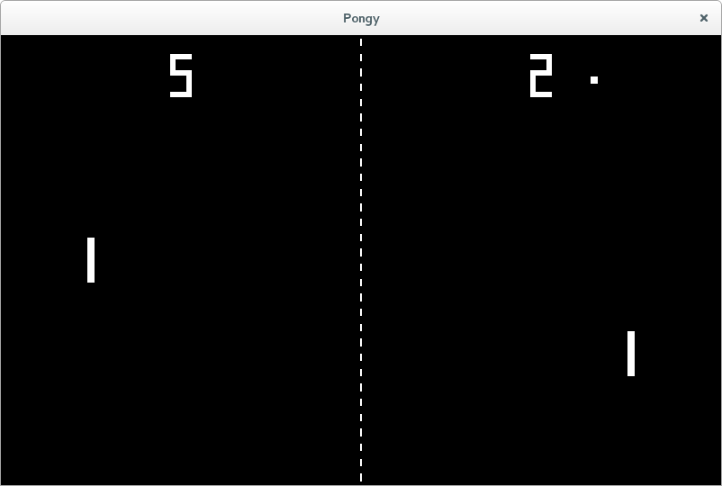

Pongy
===

### Description

Pongy is a clone of the original pong game written in
[python3](https://www.python.org) and using the [pyglet](http://www.pyglet.org)
media library.

### Controls

Player One:
- 'A' = up
- 'Z' = down

Player Two:
- 'Up Arrow' = up
- 'Down Arrow' = down

General:

- 'Esc' = exit
- 'SPACE' = start game
